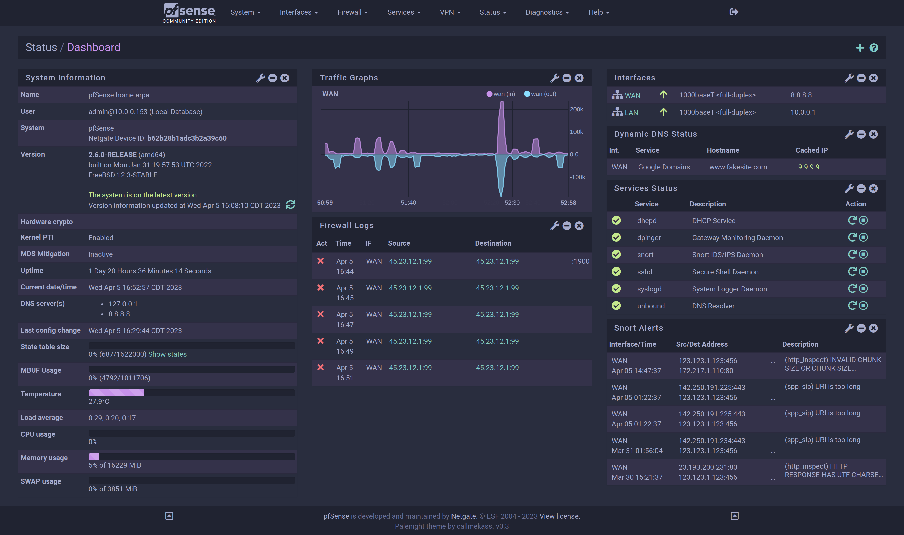

# pfSense Palenight

A palenight inspired theme for pfSense. View more [screenshots](screenshots) or checkout the [installation guide](#installation-guide).



## Installation Guide

1. Login to the web configurator
2. From the navigation menu select Diagnostics > Command Prompt
3. Download callmekass-palenight.css and place it inside of /usr/local/www/css. This can be done manually **OR** by executing the following shell command

```
curl -s https://raw.githubusercontent.com/callmekass/pfSense-palenight/script/install.php | php
```

4. From the navigation menu select System > General Setup
5. Change the theme to callmekass-palenight and click save
6. Enjoy your new theme!
